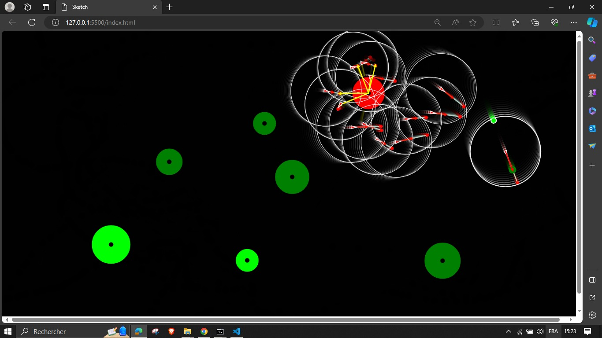

# IA pour les jeux 

Suivre un leader et éviter les obstacles

## Le travail réaliser

 - Le leader a un comportement arrive et suit la souris
 - Tous (sauf le leader) suivent le même point avec un comportement arrive dessus,
 - Tous (sauf le leader) ont un comportement separation actif
 - Si un véhicule se trouve devant le leader, il s'évade de la zone
 - Tous les véhicules évitent les obstacles.
 ## les Fonctions suplmentaire

| Event             | how                                                                |
| ----------------- | ------------------------------------------------------------------ |
| Clic de la souris | Crée un nouvel obstacle|
| La touche "v" | Crée un nouveau véhicule|
| La touche "d" | mode de débogage|

 ## Les screens
 
1

  
2

  
3

  
